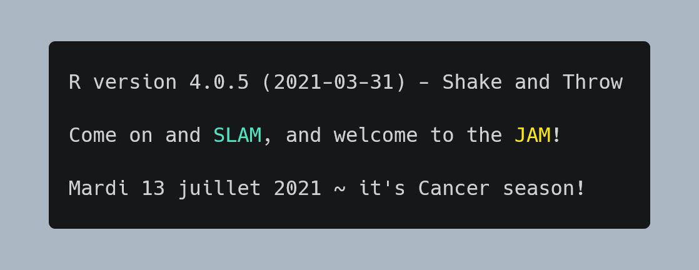

I was scrolling through Twitter and saw [this tweet](https://twitter.com/djnavarro/status/1407971934021713920?s=20) from Danielle Navarro.

<center>
<blockquote class="twitter-tweet"><p lang="en" dir="ltr">I edited my .Rprofile to show me messages that I actually like reading on startup <a href="https://t.co/3d74PDuKe1">pic.twitter.com/3d74PDuKe1</a></p>&mdash; Danielle Navarro (@djnavarro) <a href="https://twitter.com/djnavarro/status/1407971934021713920?ref_src=twsrc%5Etfw">June 24, 2021</a></blockquote> <script async src="https://platform.twitter.com/widgets.js" charset="utf-8"></script> 
</center>

I was immediately captivated. 
 
The standard R console welcome message is not cool at all, and I used to think it was inevitable until this tweet magically appeared on my timeline. Danielle linked the setup for her [`.Rprofile`](https://gist.github.com/djnavarro/0fa53868439f8db604fcd23bbef01288), which gave me some ideas for my own. The command `usethis::edit_r_profile()` opens the `.Rprofile` file in a new tab (RStudio) or in a text editor (when I tried on VS Code).

I went for a simple welcome message: the current R version, a quote from whatever thing is sticking in my head (it's currently _Space Jam_ related), today's date and the current astrological sign :star:

I also left Danielle's command that shows the current branch name when I'm working on a version-controlled project.

```r
if(interactive()) {
  
  cat("\014") # clear screen
  cli::cli_text("")
  cli::cli_text(paste0(R.version$version.string,
                       " - ",
                       R.version$nickname))
  cli::cli_text("")
  
  cli::cli_text(paste0("Come on and ",
                       cli::col_cyan("SLAM"),
                       ", and welcome to the ",
                       cli::col_yellow("JAM"),
                       "!"))
  cli::cli_text("")
  
  cli::cli_text(
    paste0(
      stringr::str_to_title(weekdays(Sys.Date()))," ",
      format(Sys.Date(), format="%d")," ",
      months(Sys.Date())," ",
      format(Sys.Date(), format="%Y"),
      " ~ it's ",
      DescTools::Zodiac(Sys.Date()),
      " season!"
    )
  )
  cli::cli_text("")
  
  # customise the prompt
  prompt::set_prompt(function(...){
    branch <- (purrr::safely(gert::git_branch))()
    if(is.null(branch$result)) return("> ")
    return(paste0("[", branch$result, "] > "))
  })
}
```

I made my changes, saved then restarted R (`Ctrl + Shift + F10` because keyboard is queen). I noticed that emojis did not render correctly no matter what I tried, which is a bummer. 

Here is how R greets me nowadays:



## TIL

* No single apostrophe in YAML. No likey.
* But rather, double apostrophe. Works.
