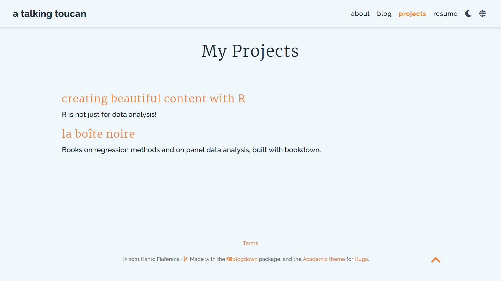
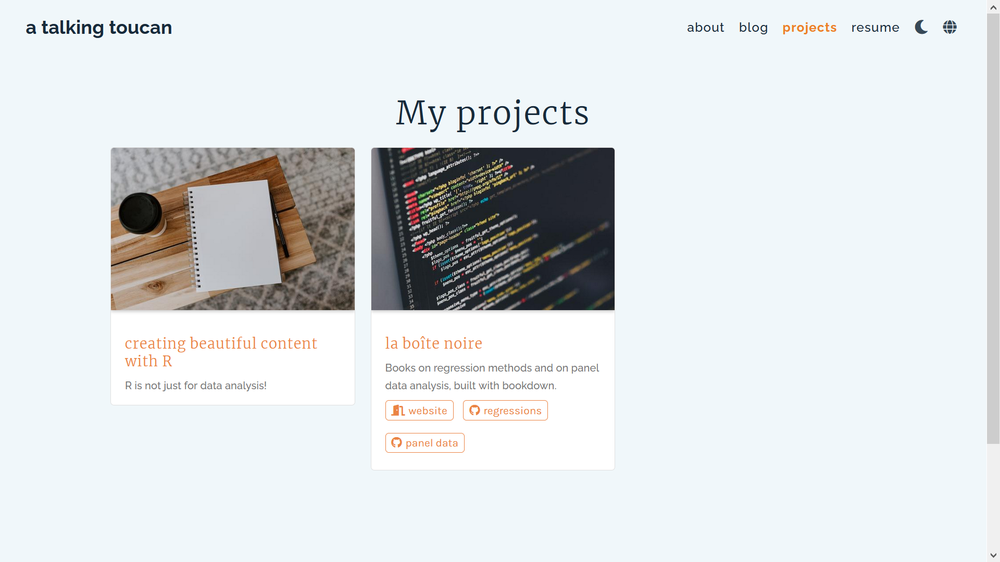

Well folks, it seems I cannot stay away from `blogdown` for long. New ideas keep coming to me at the most unfortunate moments, I find elements from other blogs that I'd like to emulate here...it's a never-ending responsibility!

This website changes every day, I feel compelled to write everything down because I don't want to forget! I get prouder and prouder of every edit I make, I want to remember how I got here.

In this article, I go over:

* The changes on my homepage, accompanied by the introduction of animation features;
* The new setup of my `custom.scss` file(s);
* And other things!

## Homepage structure

The `about.md`, `skills.md` and `posts.md` widgets constituted my former homepage that was accessible via the logo and via the **about** menu on the navigation bar. The more I looked at it, the more I found it too heavy for an introductory page. I wanted something lighter that would still quickly present me, with the summary/bio/personal details available on another page.

* I moved `about.md` and `skills.md` to an **about** widget page.
  
* The `content/home/` folder builds the homepage. I kept `posts.md` active and changed its design to a list. Then, I snooped in `themes/.../layouts/partials/widgets/` to copy `about.html` into the root project file, under the same path as the template. So `layouts/partials/widgets/about.html`.
  
* I deleted everything past the network icons, **renamed the file to** `about_custom.html` since I still wanted to use the original widget on the new widget page, and I created `about_custom.md` in `content/home` based on the existing widget.

{}
I did this before I found Isabella Benabaye's awesome blogpost, [7 Ways You Can Further Customize the Hugo Academic Theme](https://isabella-b.com/blog/hugo-academic-customization/#about-widget-without-a-summary). She also opted for an about widget without a summary, she detailed it very thoroughly and then some. It's a great post, I would have loved to have seen it when I first started moving things around on my website!
{}

This is a snippet of the YAML metadata for the standard `about.md` widget:
```yaml
widget: about
```

This is the one for my `about_custom.md` widget:
```yaml
widget: about_custom
```

It was very straightforward and it still was not enough, because I kept exploring other blogs and I became less satisfied with the fixed nature of my site's elements. Enter animations...

## Animations
You dip your toe into the animation pool once, you jump head first into it afterwards.

To be honest, I mucked up the timeline a bit, for the sake of story-telling. I did find the homepage too busy before I changed it, but I only changed it _after_ I read this great blog post by Connor Rothschild, [Animating Your Hugo Academic Site](https://www.connorrothschild.com/post/animate-hugo-academic). I read it and I went "yeah, I want to try that, that looks neat". I will not go into the details of what kind of animations you can build, Connor's article explains it way better than I would.

I cannot stress enough the importance of looking up the default templates of the Academic theme, and any other themes that you may use. It directs you towards the specific bits you may wish to edit. In the case of `about_custom`, reading its html file lead me to the classes I wanted to animate. I chose a staggered fade-in, with the avatar appearing first, the title position second and the network icons last.

This is what I did in `custom.scss` (later `_homepage-custom.scss`):
```css
#about_custom {
  @keyframes fade-in {
    0% {
      opacity: 0;
    }

    100% {
      opacity: 1;
    }
  }

  .avatar {
    animation: fade-in 3s forwards;
  }

  .portrait-title {
    opacity: 0;
    animation: fade-in 3s forwards;
    animation-delay: 0.8s;
  }

  .network-icon {
    opacity: 0;
    animation: fade-in 3s forwards;
    animation-delay: 1.3s;
  }
}
```

Because I don't know when to stop, I applied the fade-in animation to every widget/landing pages[^1].
```css
.universal-wrapper{
  animation: fade-in .5s forwards;
}

#about,
#demo,
#projects,
#experience {
  animation: fade-in .5s forwards;
}
```

Woohoo! Navigating from pages to pages feels less abrupt now. The animation is not applicable to my blogposts and my projects yet, I'm sure I'll figure it out :wink:

[^1]: I am convinced there is a faster way to apply the animation thingy for whenever you change the page, instead of listing all the different elements. I just haven't found this method yet.

## Making custom.scss more readable
All those personal changes made the `custom.scss` file quite long, which in turn made it tedious for me to find whatever item I felt like changing on the day. At first, I believed it was the only way the file could present itself, until I seriously focused on the template `assets/scss` folder: all the different elements' style file are clearly separated there under the name `_itemname.scss` in several subfolders. The `@import` function pushes them up to one `_all.scss` file per folder, that are then pushed to `wowchemy.scss`, leading to a final push to a `main.scss` file containing this magical bit:
```css
@import "bootstrap_variables";
@import "_vendor/bootstrap/bootstrap";
@import "wowchemy/wowchemy";
@import "template";
@import "custom";
```

This is when a light bulb went off: I could split my `custom.scss` file into several element-specific files, then import them into `custom.scss`! Goodbye long, unreadable file, hello clearly-named ones!

I went from:
```
assets/
├── scss
│   └── custom.scss
```

to:
```
assets/
├── scss
│   ├── _callouts-custom.scss
│   ├── _cards-custom.scss
│   ├── _code-custom.scss
│   ├── ...
│   └── custom.scss
```

This is what you can now find at the top of `custom.scss`:
```css
@import 'homepage-custom';
@import 'navbar-custom';
@import 'callouts-custom';
@import 'footer-custom';
@import 'cards-custom';
@import 'code-custom';

/* and all other general edits */
```


I believe the next step is to put all `_itemname-custom.scss` in a distinct folder, import them in `_all.scss` then import this in `custom`. That will be another task for another time.

## Other small edits

* [I changed the `post` slug to `blog`](https://wowchemy.com/docs/guide/extending-wowchemy/#permalinks) for the heck of it, although it did not apply to the blog "menu". There is one caveat: I had to modify one-by-one every links that contained `post`[^2];
* I changed the displayed post date from 'last modification' to the date of publication/creation, after reading Isabella's post;
* I finally created a pretty project widget-page, by changing the folder name from `project` to `projects`. The design now works. Yay!




  

  <center><i>What my project page used to look like</i></center>



  

  <center><i>What my project page looks like now</i></center>




[^2]: I have a feeling that a `_redirects` file would have spared me from this ordeal.

### New callout block
There is one final change that deserves its own section.

I caved in, I created a callout note and changed the default ones a little bit. Me from a week ago is rolling her eyes.


I would not know how to explain my process. What I can say is that I cross-examined [Alison Hill's](https://github.com/pyrrhamide/apreshill/blob/784d739f78c785417268c8351333ed131fe75677/assets/scss/custom.scss#L140) and [Isabella Benabaye's](https://github.com/isabellabenabaye/isabella-b.com/blob/e576b13bf25d5ddee711edc4adca9c353f0734d0/assets/scss/custom.scss#L487) `custom.scss` files with the [callout template](https://github.com/pyrrhamide/mission-website/blob/eafdeadc9d05e4bb1b9a0faa4771fef248dda47d/themes/github.com/wowchemy/wowchemy-hugo-modules/wowchemy/assets/scss/wowchemy/elements/_callout.scss), and I ended up with my simple and green callout that you can find in `_callouts-custom.scss` rather than `custom.scss`!

Here is the final result:
```html
{}
This is my new catch-all callout note.
{}
```
{}
This is my new catch-all callout note.

I will probably mainly use it to say hello from the future :star2:
{}

## Update on HTTPS

_Previously, on **a talking toucan**..._

I requested a free `*.rbind.io` subdomain from RStudio, got it, [redirected HTTP links to HTTPS](https://yihui.org/en/2017/11/301-redirect/), and this is when all hell broke loose. I talked about it on the [french side](/fr/blog/decorer-le-site/#bonus-le-sous-domaine-rbindio): I kept (or keep, really) being sent to an error 526 page, saying the SSL certificate is invalid.

Alright, that's fine, the subdomain is new, I'll give it some time to do its thing and reach the entire World Wide Web! Well, it got worse: it became a daily occurrence and got to the point where I could not browse any other `*.rbind.io` subdomains.

I'm based in Paris, the website depends on the Cloudflare Frankfurt server, so I thought I'd whip out my trusty VPN and try other European locations. No luck. The United States of America? Yes luck. Urgh.

The issue appears to be European-centric. I sent a [report](https://github.com/rbind/support/issues/789#issuecomment-827488131) to let the kind people of RStudio know what's up, I'll see how it goes from here!

{}
**Update**: it's fixed!
{}

## BONUS: Today I Learned

* The difference between CSS IDs (`#ID`) and classes (`.class`). I know this is _la base de la base_, yeah, but Rome wasn't built in a day.
```html
<div id="whole">
  <div class="smol">
  </div>
</div>
```
* That you can link a line from a GitHub file by clicking on the line number. Those are really the simplest, yet the most useful things.
* That you can (and should) write the language used right after the first three apostrophes signalling a chunk of code, so that colours don't turn dodgy.
* Of GitHub gists' existence: great to share version-controlled snippets of code. Technology rules.
