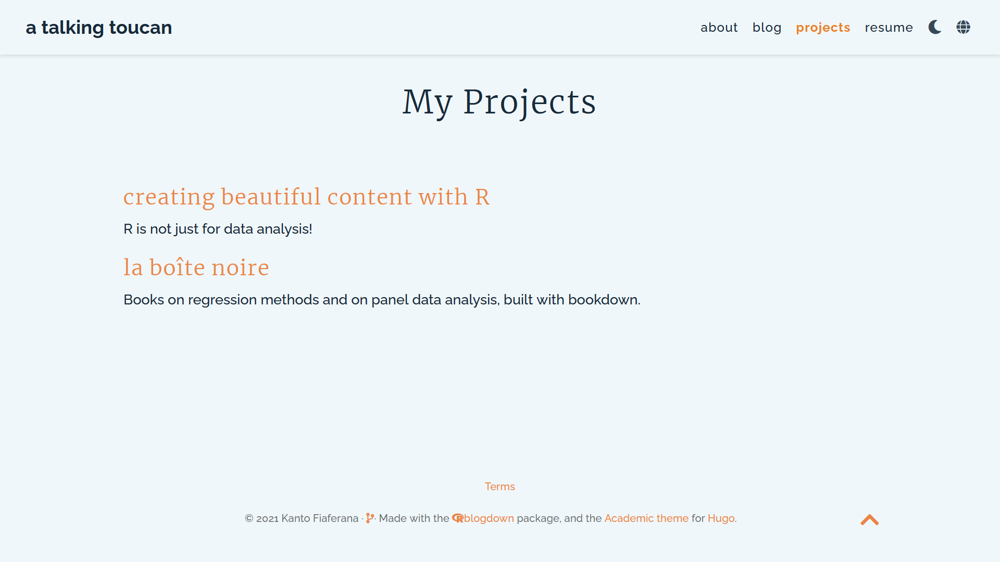
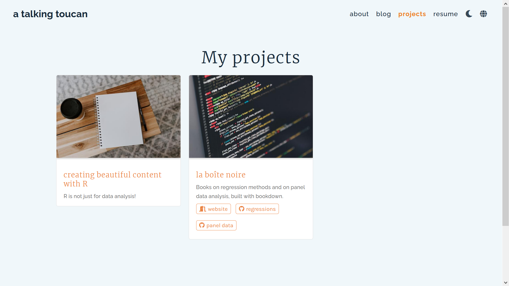

{}

Modifier un site est addictif. De nouvelles idées me viennent aux moments les plus inopportuns, je découvre de nouveaux blogs qui possèdent des éléments que j'aimerais beaucoup introduire ici...bref, tout bouge tout le temps comme la météo infernale de ces derniers mois.

_**un toucan qui parle**_ change légèrement de visage tous les deux jours, et comme je l'ai dit auparavant, mon historique de modifications est devenu trop dense pour que je me rappelle de tout ce que j'ai fait. Je suis de plus en plus fière de l'évolution de ce site, mais il est important de ne pas oublier d'où on est parti.

Dans cet article, je couvre les sujets suivants:

* La refonte de ma page d'accueil, accompagnée de l'introduction d'animations;
* La nouvelle configuration de mon fichier `custom.scss`;
* D'autres petits détails.

## Page d'accueil

Les widgets `about.md`, `skills.md` et `posts.md` constituaient mon ancienne page d'accueil qui était accessible via le logo et via le menu "à propos" sur la barre de navigation. Cependant, le plus je scrutais cette page, le plus je la trouvais trop chargée pour une première visite du site. Je voulais quelque chose de plus simple qui me présente succinctement, avec plus de détails sur une nouvelle page.

* J'ai déplacé `about.md` et `skills.md` dans un nouveau dossier `content/about/` et ai défini ce dossier comme une page widget.
* Le dossier `content/home/` construit la page d'accueil. J'ai gardé `posts.md` activé et j'ai changé sa mise en forme pour une liste. Ensuite, j'ai fouillé dans `themes/.../layouts/partials/widgets/` pour copier `about.html` dans le dossier racine (ça se dit?) du site, en suivant le même chemin que celui du modèle, soit `layouts/partials/widgets/about.html`.
* Dans `about.html`, j'ai supprimé tout ce qu'il y avait après les logos des réseaux sociaux, **j'ai renommé le fichier `about_custom.html`** puisque je voulais quand même utiliser le widget de base dans la nouvelle page "à propos", puis j'ai créé `about_custom.md` dans `content/home` en me basant sur `about.md`.

{}
J'ai effectué ces changements avant de trouver l'article d'Isabella Benabaye, [7 Ways You Can Further Customize the Hugo Academic Theme](https://isabella-b.com/blog/hugo-academic-customization/#about-widget-without-a-summary). Elle a aussi opté pour un widget "à propos" sans paragraphe biographique: elle détaille comment faire ça, et elle parle même de modifications supplémentaires que je n'applique pas. C'est un excellent article, j'aurais adoré l'avoir sous la main avant de commencer à charcuter mon site.
{}

Voici le morceau du fichier `about.md` qui indique quel widget on utilise:
```yaml
widget: about
```

Et dans `about_custom.md`:
```yaml
widget: about_custom
```

Ce n'était pas sorcier, et ce n'était pas suffisant. Je n'étais plus très satisfaire avec "l'immobilité" du site, et c'est pour cette raison que j'ai introduit des animations.

## Animations
J'ai légèrement menti sur la chronologie pour embellir mon récit. VRAI: je trouvais la page d'accueil trop chargée avant de la changer. FAUX: je n'ai pas introduit les animations par hasard, après avoir modifié la page d'accueil. VRAI: j'ai lu le très bon article de Connor Rothschild, [Animating Your Hugo Academic Site](https://www.connorrothschild.com/post/animate-hugo-academic), je l'ai adoré et je me suis dit que j'allais essayé de faire ça ici. Je n'entre pas dans les détails, l'article de Connor explique très bien les bases.

J'insiste beaucoup sur l'importance de jeter un coup d'oeil au dossier `themes` qui contient les éléments de base du modèle Academic, ou n'importe quel modèle utilisé. Ca permet de maîtriser la structure du site et de cibler les élements qu'on souhaite modifier. Dans le cas de mon widget `about_custom`, j'ai lu le fichier html et j'ai noté les noms des classes que je voulais animées. J'ai choisi un effet décale en fondu, avec l'apparition de l'avatar en premier, suivie de ma "position" et finalement les symboles des réseaux sociaux.

Voici ce que j'ai fait dans `custom.scss` (plus tard renommé `_homepage-custom.scss`) :
```css
#about_custom {
  @keyframes fade-in {
    0% {
      opacity: 0;
    }

    100% {
      opacity: 1;
    }
  }

  .avatar {
    animation: fade-in 3s forwards;
  }

  .portrait-title {
    opacity: 0;
    animation: fade-in 3s forwards;
    animation-delay: 0.8s;
  }

  .network-icon {
    opacity: 0;
    animation: fade-in 3s forwards;
    animation-delay: 1.3s;
  }
}
```

Je ne me suis pas arrêtée à la page d'accueil: j'ai appliqué cette animation sur l'ensemble du site[^1].
```css
.universal-wrapper{
  animation: fade-in .5s forwards;
}

#about,
#demo,
#projects,
#experience {
  animation: fade-in .5s forwards;
}
```

La navigation entre chaque page est maintenant plus douce. Ce n'est plus qu'une question de temps et de détermination pour que j'arrive à appliquer cette animation aux articles et aux projets :wink:

{}
**Màj un jour en mai 2021**: j'ai réussi, gg moi.
{}

[^1]: Il doit y avoir un moyen plus rapide d'appliquer l'animation pour chaque changement de page, au lieu de spécifier les éléments auxquels attribués l'animation. Je n'ai pas encore trouvé la solution !

## Organisation de `custom.scss` 

Tous ces changements esthétiques ont élargit mon fichier `custom.scss`, ce qui compliquait les changements ponctuels puisque je passais beaucoup de temps à chercher la ligne à changer. Je pensais que c'était la seule manière de présenter ce fichier, jusqu'à ce que je me concentre sérieusement sur le dossier  `assets/scss`  d'Academic: tous les différents styles de chaque élément sont séparés dans des fichiers individuels `_itemname.scss` dans plusieurs sous-dossiers. La fonction `@import` les pousse vers un fichier `_all.scss` par dossier, qui sont ensuite poussés vers `wowchemy.scss`, avec le dernier poussage vers `main.scss` qui contient ce bout de magie:

```css
@import "bootstrap_variables";
@import "_vendor/bootstrap/bootstrap";
@import "wowchemy/wowchemy";
@import "template";
@import "custom";
```

J'ai compris alors que je pouvais diviser `custom.scss` en plusieurs fichiers spécifiques à chaque élément, puis importer ces nouveaux fichiers dans `custom.scss`. 

L'ancienne structure se présentait ainsi:
```
assets/
├── scss
│   └── custom.scss
```

Et ressemble maintenant à:
```
assets/
├── scss
│   ├── _callouts-custom.scss
│   ├── _cards-custom.scss
│   ├── _code-custom.scss
│   ├── ...
│   └── custom.scss
```

Voici ce qu'on peut trouver au tout début de `custom.scss`:
```css
@import 'homepage-custom';
@import 'navbar-custom';
@import 'callouts-custom';
@import 'footer-custom';
@import 'cards-custom';
@import 'code-custom';

/* et d'autres modifications qui sont générales au site */
```


L'amélioration du dessus serait de déplacer tous les `_itemname-custom.scss` dans un dossier à part de `assets/scss/`, les importer dans `_all.scss` que j'importerais ensuite dans `custom`. Ce sera pour une prochaine fois !

## Autres modifications "minimes"

* [J'ai modifié le slug `post` en `blog`](https://wowchemy.com/docs/guide/extending-wowchemy/#permalinks) parce que j'avais du temps à perdre, quoique ça ne s'est pas diffusé au menu du blog. Ce changement présente un inconvénient: j'ai dû modifié individuellement tous les liens qui contenait le slug `post`[^2];
* J'ai changé la date affichée en modifiant la classe `article-date` du template `layouts/partials/page_metadata.html`: au lieu de la date de dernière mise-à-jour, le site affiche la date de création/publication de l'article;
* J'ai enfin créé une belle page de menu des projets, en changeant le nom du dossier de `project` à `projects`. La mise en forme fonctionne !



<center><i>L'ancien menu projet - version anglaise</i></center>



<center><i>Le nouveau menu projet - version anglaise</i></center>

[^2]: Un fichier `_redirects` aurait sans doute simplifié ma vie.

### Un nouveau bloc de texte

Un dernier changement mérite sa propre section.

J'ai craqué, j'ai créé un nouveau bloc de texte et j'ai changé l'apparence des autres. La moi de l'article précédent me regarde de travers.


Je ne peux pas décrire précisément ce que j'ai fait. En gros, j'ai scruté très fort les fichiers `custom.scss` d'[Alison Hill](https://github.com/pyrrhamide/apreshill/blob/784d739f78c785417268c8351333ed131fe75677/assets/scss/custom.scss#L140) et d'[Isabella Benabaye](https://github.com/isabellabenabaye/isabella-b.com/blob/e576b13bf25d5ddee711edc4adca9c353f0734d0/assets/scss/custom.scss#L487) et j'ai incorporé les trucs qui m'intéressaient dans une copie du [modèle callout](https://github.com/pyrrhamide/mission-website/blob/eafdeadc9d05e4bb1b9a0faa4771fef248dda47d/themes/github.com/wowchemy/wowchemy-hugo-modules/wowchemy/assets/scss/wowchemy/elements/_callout.scss). Il y a maintenant un bloc de texte vert qu'on peut retrouver dans  `_callouts-custom.scss` au lieu de dans `custom.scss`.

Voici le résultat final :
```html
{}
C'est le nouveau bloc de texte spécial.
{}
```
{}
C'est le nouveau bloc de texte spécial.

Je pense l'utiliser pour des petites mises à jour et autres :star2:
{}

## Mise à jour sur le protocole HTTPS

_Dans le dernier épisode d'**un toucan qui parle**..._

J'avais demandé un sous-domaine `*.rbind.io` à RStudio, je l'ai eu, [j'ai redirigé mes liens de HTTP à HTTPS](https://yihui.org/en/2017/11/301-redirect/), et ce fut le début d'un gros problème. J'en ai parlé [vite fait](/fr/blog/decorer-le-site/#bonus-le-sous-domaine-rbindio): j'atterrissais très (trop) souvent sur une page d'erreur 526 qui disait que le certificat SSL était invalide.

Dacodac, le sous-domaine est nouveau, je vais lui donner du temps pour se propager sur l'ensemble du World Wide Web ! Pas de bol, le problème s'est intensifié au point de devenir quotidien et de m'empêcher d'accéder à d'autres sites `*.rbind.io`.

Je suis à Paris, je dépends du serveur Cloudflare de Frankfort. J'ai activé mon VPN pour voir si le problème s'étendait à d'autres villes d'Europe, et c'était le cas. Ensuite j'ai testé les États-Unis: ça fonctionnait...mince alors.

J'ai envoyé un [rapport](https://github.com/rbind/support/issues/789#issuecomment-827488131) à l'équipe de RStudio pour les mettre au courant, le problème est maintenant réglé !

## BONUS: Aujourd'hui j'ai appris

* La différence entre les IDs (`#ID`) et les classes (`.class`), définis en HTML, personnalisés en CSS. Je sais que c'est _la base de la base_, mais au moins je sais !!
```html
<div id="whole">
  <div class="smol">
  </div>
</div>
```
```css
#whole {
}
.smol {
}
```
* Qu'on peut créer un lien renvoyant à une ligne d'un fichier hébergé sur GitHub, en cliquant sur le numéro de la ligne en question. 
* Qu'on peut (et qu'on devrait) écrire le langage utilisé après les trois apostrophes d'un bloc de code, pour que la mise en forme des couleurs et toussa soient corrects.
* L'existence de GitHub gists : parfait pour partager des fichiers de code, sous contrôle de versions. Le progrès technologique est fantastique.
